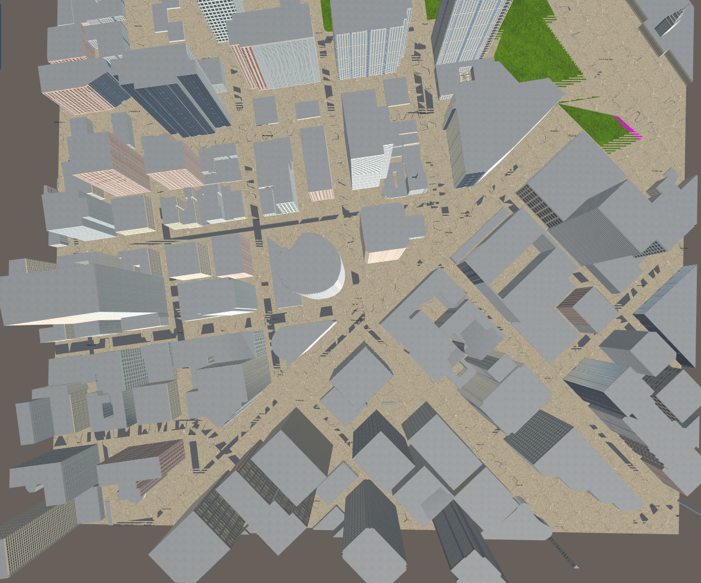

## Project: 3D Motion Planning

---

#### Explain the Starter Code

#### 1. Functionality provided in `motion_planning.py` and `planning_utils.py`

***'motion_planning'*** script controls the basic actions the drone can take.

There are seven states that drone can be in.

****MANUAL**** : This is the default state where the script got no contorl of the drone

****ARMING**** : The scripts takes control over the drone, once armed the drone takes steering, navigation input from the script.

****PLANNING**** : The navigation path is derived using the A* algorithm for the given map which is used as input for the waypoint to guide the drone to follow the waypoint. Additional the initial altiite, source and destination are all set in this planning phase. This forms the * PLAN * for the drone.

****TAKEOFF**** : The drones takes off to the intial set altitude vertically. It uses the callback to determined the velocity and position of the drone to hover to the set takeoff altitude.

****WAYPOINT**** : This is the heart of the drone motion, which determines the current drone spot and gudies it through the planned waypoint unitl the destinaiton point is reached.

****LANDING**** : Once the destiantion point as per the plan is reached. The drone is instructed to land. Only veritical motion and no horizontal movement in this phase.

****DISARMING**** : Drone is disconnected from the auto pilot. Teh script can no longer contorl the drone.

***'planning_utils'*** contain a basic planning implementation that includes reading the 2.5d plan and generating the 2d grid which can be used to navigate the drone in. It also holds the A* implementation that generates the path to be used to reach the destination.

### Implementing Your Path Planning Algorithm

#### 1. Set your global home position

Read the first line of the csv file, extract lat0 and lon0.

Extract lat0,  long0 as floating point values and use the self.set_home_position() method to set global home.

And here is a lovely picture of our downtown San Francisco environment from above!

Simulated city environment

Pixelated view of the map (altitue 0)

#### 2. Set your current local position

We will set the global home and global postion to the retrived (lan, lon) value. We will now convert this to local co-ordinates.

#### 3. Set grid start position from local position

We now generate 2D view of the map (altitude 5 m and safe distance of 5 m from obstacles), the start local position calculated above is marked by an 'X'

#### 4. Set grid goal position from geodetic coords
This step is to add flexibility to the desired goal location. Should be able to choose any (lat, lon) within the map and have it rendered to a goal location on the grid.

The calculated goal position will be fed into motion planning. The goal position is marked in orange 'x' on the map

Let's calculate the goal postioin for another random position on the map.

#### 5. Modify A* to include diagonal motion (or replace A* altogether)

Let's first  run the vanial A* with only horizontal and veritcal motion allowed. A* algorithm is found in planning_utils()

Even thought it seems that path got diagonal lines, but when in details it is nothing but smail steps motion. The safe distance has been set to 0, for better visualisation of the path taken.

Now we will update the A* implementation to include diagonal motions on the grid that have a cost of sqrt(2).

    WEST = (0, -1, 1)
    EAST = (0, 1, 1)
    NORTH = (-1, 0, 1)
    SOUTH = (1, 0, 1)

    # New addition for diagonal path
    SOUTH_EAST = (1, 1, sqrt(2))
    NORTH_EAST = (-1, 1, sqrt(2))
    SOUTH_WEST = (1, -1, sqrt(2))
    NORTH_WEST = (-1, -1, sqrt(2))

Video of drone completing the unpruned path with multiple waypoint one for each grid.

#### 6. Cull waypoints 

The idea is simply to prune the path of unnecessary waypoints using collinearity test.

Prune path points from `path` using collinearity.

    def point(p):
        return np.array([p[0], p[1], 1.]).reshape(1, -1)

    def collinearity_check(p1, p2, p3):
        m = np.concatenate((p1, p2, p3), 0)
        det = np.linalg.det(m)
        return abs(det) < epsilon

    pruned_path = [p for p in path]
    i = 0
    while i < len(pruned_path) - 2:
        p1 = point(pruned_path[i])
        p2 = point(pruned_path[i+1])
        p3 = point(pruned_path[i+2])

        # If the 3 points are in a line remove
        # the 2nd point.
        # The 3rd point now becomes and 2nd point
        # and the check is redone with a new third point
        # on the next iteration.
        if collinearity_check(p1, p2, p3):
            # Something subtle here but we can mutate
            # `pruned_path` freely because the length
            # of the list is check on every iteration.
            pruned_path.remove(pruned_path[i+1])
        else:
            i += 1

### Execute the flight
#### 1. Does it work?
It works!
